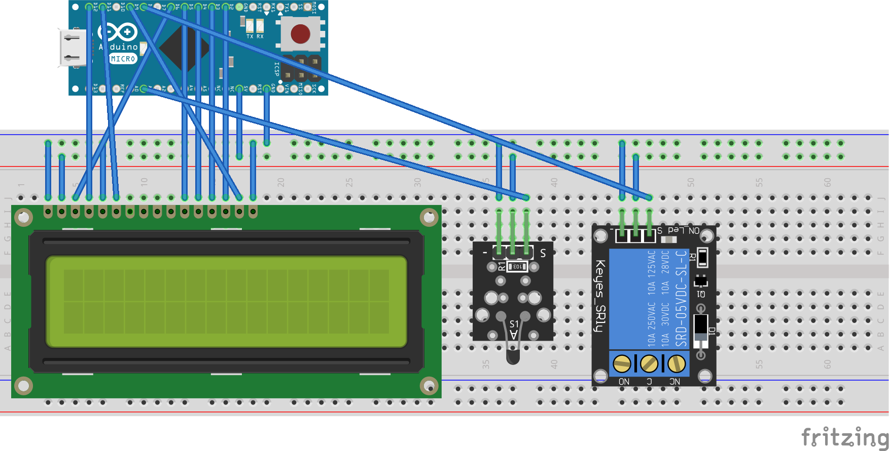

# Home Thermostat
This is my first project for Internet Of Things.

Currently it is working and I have plans to add new functional, remote and local controls, and add new sensors. 

On the end I want to do a module system for different use cases.

## Devices
- Arduino Nano with ATmega328P(Chinese version)
- 1-channel relay module
- KY-013 analog temperature sensor
- PocketCHIP for remote control (Arduino connected to the USB serial port)

## Tools
- for Arduino you need CmdMessenger libreary(install it in "Manage Library" in Arduino IDE
- for remote control you need [PyCmdMessenger](https://github.com/harmsm/PyCmdMessenger)

## Current Version
- now you can keep temperature in the room use control relay with heat device
- current settings save in the ROM and return after restart Arduino
- for remote control temperature use Linux, Windows or any IOF devices with USB port(instruction inside Thermostat.py)
- information about current temperature, set temperature and status you can see on the display

## Plans
1. use second temperature sensor for control heat around heat device(safety first)
2. use second relay and PWM for control FAN(S)
3. make a web remote control and applications for mobile devices
